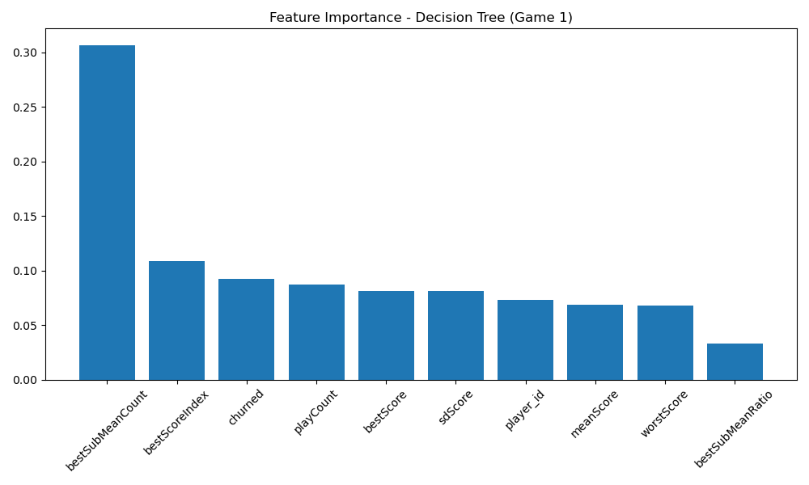
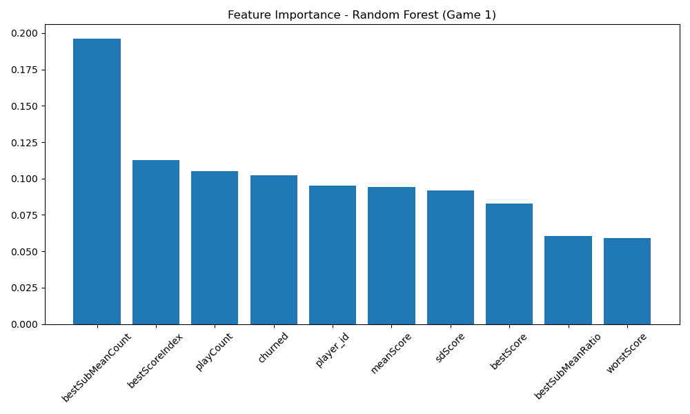
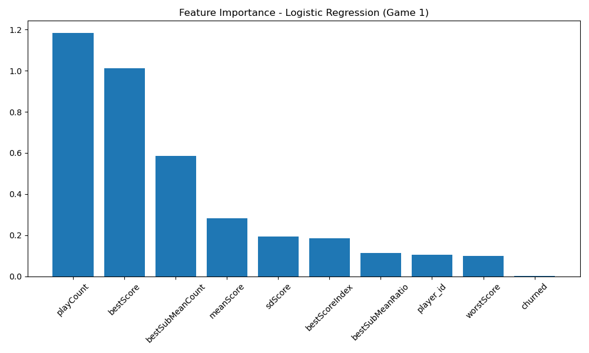
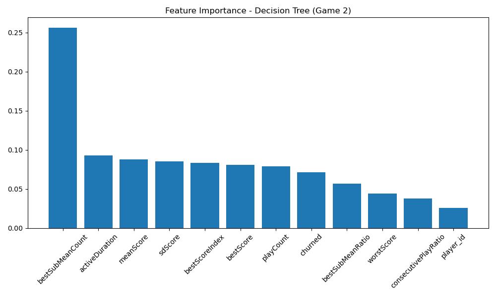
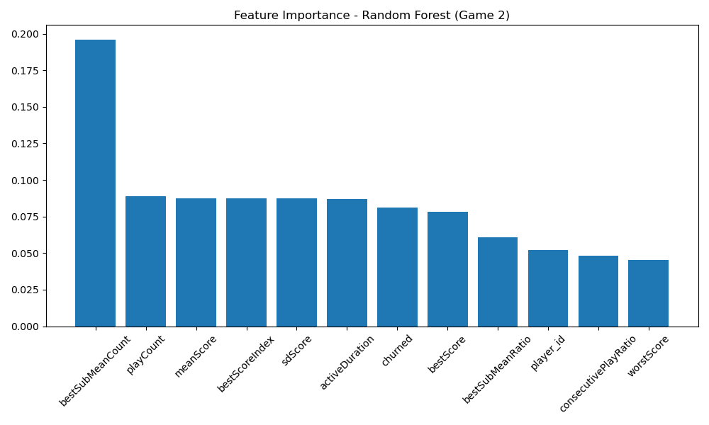
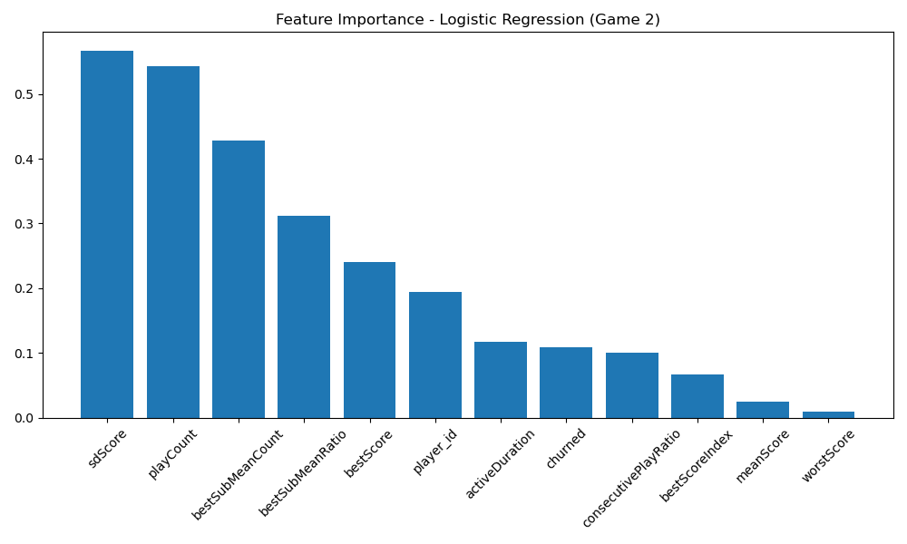
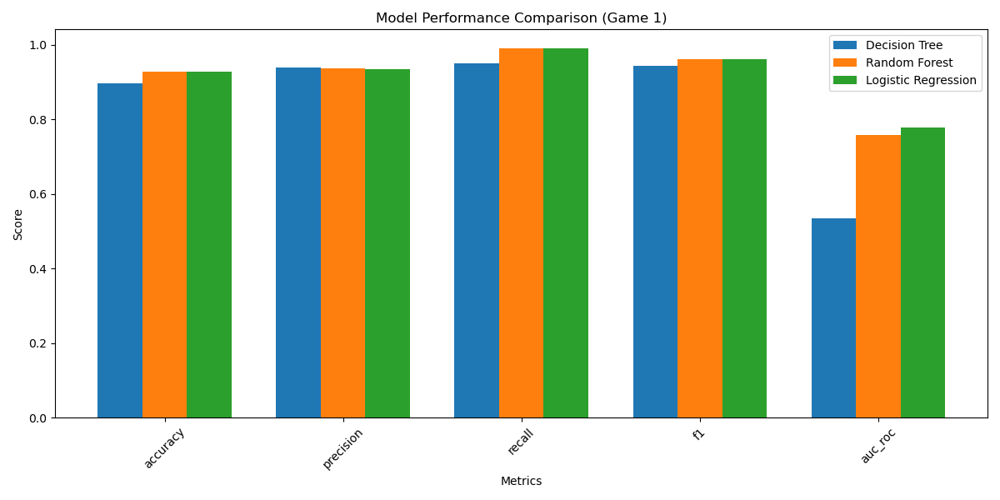
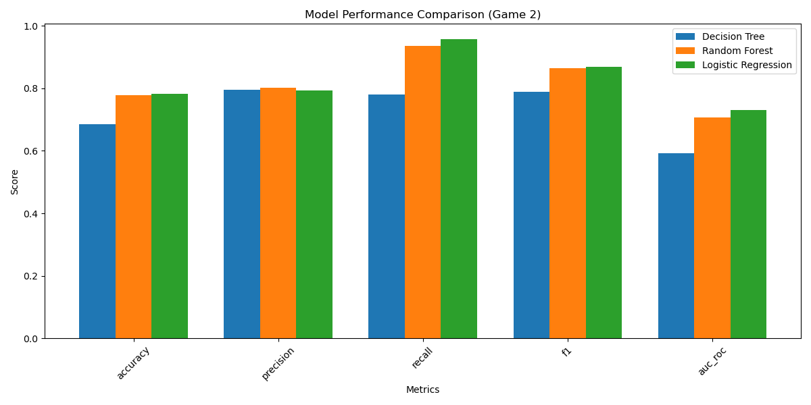

# Model Training and Evaluation Summary

## Models Used

Three different classification models were implemented:

- **Decision Tree Classifier**
- **Random Forest Classifier** (with 100 estimators)
- **Logistic Regression**

## Metrics Comparison

### Game 1

- **Best Performing:** Logistic Regression
    - Highest accuracy (**92.91%**)
    - Best AUC-ROC score (**0.778**)
    - Excellent recall (**99.19%**)
- **Close Second:** Random Forest
    - Very similar accuracy (**92.82%**)
    - Good AUC-ROC score (**0.758**)
    - High recall (**98.98%**)
- **Worst Performing:** Decision Tree
    - Lower accuracy (**89.62%**)
    - Poor AUC-ROC score (**0.536**)

### Game 2

- **Best Performing:** Logistic Regression
    - Highest accuracy (**78.15%**)
    - Best AUC-ROC score (**0.731**)
    - Highest recall (**95.83%**)
- **Close Second:** Random Forest
    - Good accuracy (**77.83%**)
    - Decent AUC-ROC score (**0.708**)
- **Worst Performing:** Decision Tree
    - Much lower accuracy (**68.53%**)
    - Poor AUC-ROC score (**0.593**)

## Key Observations

- All models performed significantly better on **Game 1** than **Game 2**.
- **Logistic Regression** consistently performed best across both games.
- **Decision Trees** consistently performed worst, suggesting the data may be too complex for simple tree-based decisions.
- The performance gap between models is larger in **Game 2**, indicating a more challenging classification task.

## Model Training Process and Code Insights

The model training process is implemented in Python using scikit-learn and pandas, as detailed in the `model_training.py` script. The workflow for both games is as follows:

1. **Data Loading:**
   - Processed feature datasets for each game and split (train/test) are loaded from CSV files.
   - Features and labels are separated, with `player_id` and `churned` columns handled appropriately.

2. **Feature Preparation:**
   - Features are converted to numpy arrays for compatibility with scikit-learn models.
   - For Logistic Regression, features are standardized using `StandardScaler` to improve model performance.

3. **Model Training:**
   - Three classifiers are initialized: Decision Tree, Random Forest (with 100 estimators), and Logistic Regression.
   - Each model is trained on the training data. Logistic Regression uses the scaled features, while tree-based models use the raw features.

4. **Evaluation:**
   - Each trained model is evaluated on the test set using metrics such as accuracy, precision, recall, F1 score, and AUC-ROC.
   - Predictions and probability scores are generated for metric calculation.

5. **Visualization:**
   - Feature importance is plotted for each model (where available) and saved as PNG files.
   - A comparison plot of all model metrics is also generated for each game.

6. **Results Saving:**
   - All evaluation metrics are saved as JSON files for further analysis and reporting.

**Code Structure Highlights:**
- The code is modular, with functions for loading data, preparing features, training models, evaluating, and plotting.
- The main loop iterates over both games, ensuring a consistent process.
- The use of scikit-learn's API allows for easy extension or modification of models and metrics.

This structured approach ensures reproducibility and clarity in the model evaluation process, making it straightforward to compare model performance across different games and datasets.

## Visualizations

To further support the evaluation, the following visualizations are included:

### Feature Importance Plots

- 
- 
- 
- 
- 
- 

### Model Metrics Comparison

- 
- 

These images provide a visual summary of feature importance for each model and a direct comparison of model performance metrics for both games.

## LLM-based Churn Prediction or Analysis

In addition to traditional machine learning models, we implemented and evaluated a **DistilBERT-based** approach for churn prediction. This transformer-based model was tested on both games to explore the potential of natural language processing techniques for player behavior analysis.

### DistilBERT Model Performance

#### Game 1 Results
- **Accuracy:** 50.00%
- **Precision:** 50.00%
- **Recall:** 100.00%
- **F1 Score:** 66.67%
- **AUC-ROC:** 0.00

#### Game 2 Results
- **Accuracy:** 50.00%
- **Precision:** 50.00%
- **Recall:** 100.00%
- **F1 Score:** 66.67%
- **AUC-ROC:** 0.00

### Analysis of LLM Results

The DistilBERT model showed **significantly poorer performance** compared to the traditional machine learning approaches:

1. **Random Performance**: The 50% accuracy across both games suggests the model is performing at random chance level, indicating it has not learned meaningful patterns from the data.

2. **Perfect Recall, Poor Precision**: The 100% recall with 50% precision indicates the model is classifying all or most players as churned, which is not useful for practical churn prediction.

3. **Zero AUC-ROC**: An AUC-ROC score of 0.00 suggests the model has no discriminative ability between churned and non-churned players.

4. **Consistent Poor Performance**: The identical metrics across both games suggest systematic issues with either:
   - Data preprocessing for the LLM model
   - Feature representation incompatibility with transformer architectures
   - Model configuration or training issues

### Comparison with Traditional ML Models

| Model Type | Game 1 Accuracy | Game 2 Accuracy | Best Traditional ML |
|------------|------------------|------------------|-------------------|
| **DistilBERT** | 50.00% | 50.00% | Poor |
| **Logistic Regression** | 92.91% | 78.15% | Excellent |
| **Random Forest** | 92.82% | 77.83% | Very Good |
| **Decision Tree** | 89.62% | 68.53% | Good |

The traditional machine learning models significantly outperformed the LLM-based approach, with **Logistic Regression achieving ~43-28 percentage points higher accuracy** than DistilBERT.

### Recommendations for LLM Approaches

1. **Feature Engineering**: The current numerical features may not be suitable for transformer models. Consider creating textual representations of player behavior patterns.

2. **Model Architecture**: Explore specialized architectures designed for tabular data or time series, rather than text-focused transformers.

3. **Data Preprocessing**: Investigate different ways to represent player behavioral data that align better with LLM input expectations.

4. **Hybrid Approaches**: Consider combining traditional ML features with LLM-generated embeddings or insights.

For this churn prediction task, **traditional machine learning models remain the superior choice**, particularly Logistic Regression and Random Forest, which demonstrate both high accuracy and practical interpretability.

## Project Structure Overview

Below is a summary of the key modules involved in the pipeline:

```
project-root/
├── src/
│   ├── data_processing/
│   │   ├── data_preparation.py      # Data loading, cleaning, and splitting
│   │   ├── dataset_creation.py      # Observation/churn period labeling
│   │   ├── feature_engineering.py   # Feature extraction from player data
│   │   └── pipeline.py              # Orchestrates the data pipeline
│   ├── model_training.py            # Model training, evaluation, and reporting
│   ├── llm_prediction.py            # LLM-based prediction module
│   └── ...
├── results/
│   ├── features/                    # Extracted feature CSVs
│   ├── models/                      # Trained model files
│   └── ...
├── plots/                           # Visualizations
└── ...
```

- **data_preparation.py**: Handles raw data conversion, cleaning, and splitting into train/eval sets.
- **feature_engineering.py**: Extracts behavioral features from player event logs for ML.
- **model_training.py**: Trains and evaluates machine learning models, generates metrics and plots.
- **llm_prediction.py**: (Optional) Module for LLM-based churn prediction or analysis.

This modular structure ensures each stage of the pipeline is clear, maintainable, and extensible for future work.